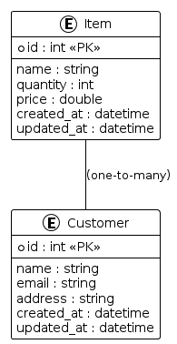

# delivergate-pharmacy-management-system-php

This repository contains the backend project for a pharmacy management system developed for Delivergate by [Udayasooriyan Prabudeva](https://github.com/prabud0401) using PHP Laravel Framework. The system allows for inventory management, customer record maintenance, and user privilege management, adhering to the specified requirements.

## GitHub Repository:
- [GitHub Repository](https://github.com/prabud0401/delivergate-pharmacy-management-system-php.git)
- SSH Repository : git@github.com:prabud0401/delivergate-pharmacy-management-system-php.git

## Notion Documentation:
- [Notion Documentation](https://full-wallet-edc.notion.site/d67d9688b898446ba3c0eba85a0c6e1c?v=a22922ed4ae44417a62e56bc93822f91&pvs=4)

## Features:
- **Inventory Management**: Allows the owner to maintain inventory (medicines).
- **Customer Record Maintenance**: Enables the owner and manager to maintain customer records, including customer details.
- **User Privilege Management**: Implements user privilege policies where:
  - Only the owner can add items/customers.
  - Cashiers can remove and edit items.
  - Managers can update and delete customer details.
- **User Logging Mechanism**: Proper user logging mechanism is implemented to manage the above-mentioned policies.

## Repository Contents:
- **Backend Project**: Contains Laravel backend project.
- **Database Diagram**: Provides an ER diagram for the database structure.
- **Documentation**: Includes a brief document explaining the project functionality and purpose of each endpoint.
- **Postman Collection**: Contains a Postman request collection for project endpoints.

## How to Run:
1. Clone this repository to your local machine.
2. Install dependencies using `composer install`.
3. Set up your database in the `.env` file and run migrations using `php artisan migrate`.
4. Serve the application using `php artisan serve`.

## API Endpoints:
- **Add Items/Customer (Owner Only)**: `/api/items`, `/api/customers`
- **Remove/Edit Items (Cashier Only)**: `/api/items/{id}`, `/api/customers/{id}`
- **Update/Delete Customer Details (Manager Only)**: `/api/customers/{id}`

## Database Structure:

### Inventory Table:
- **Table Name:** `items`
- **Fields:**
  - `id`: Primary Key, Auto-increment
  - `name`: Name of the item (e.g., medicine name)
  - `quantity`: Quantity of the item available in the inventory
  - `price`: Price of the item
  - `created_at`: Timestamp
  - `updated_at`: Timestamp

### Customer Table:
- **Table Name:** `customers`
- **Fields:**
  - `id`: Primary Key, Auto-increment
  - `name`: Name of the customer
  - `email`: Email address of the customer
  - `phone`: Phone number of the customer
  - `address`: Address of the customer
  - `created_at`: Timestamp
  - `updated_at`: Timestamp

## Documentation:
[Link to Documentation](./Documentation/Pharmacy%20Management%20System%20Documentation.pdf)

## Postman Collection:
[Link to Postman Collection](./Documentation/Postman%20Request%20Collection%20Documentation.pdf)

For any inquiries, please contact [prabud0401@gmail.com](mailto:prabud0401@gmail.com).
